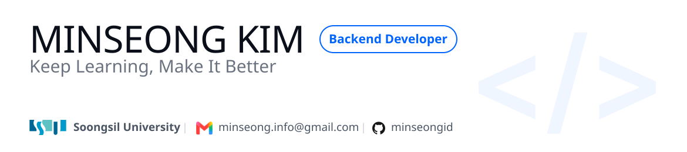

  

 

  

## 🙋 About

Hi! I'm a backend developer who enjoys learning new things and building them hands-on.

안녕하세요! 새로운 것을 배우고 직접 만들어보는 과정을 즐기는 백엔드 개발자입니다.

 

## 🛠️ Tech Stack

**Language**

  

**Framework**

  

**Database**

  

**Infra & DevOps**

  

**Collaboration**

  

 

## 🚀 Projects

### 📦 [Baton](https://github.com/team-tktk)
기업 구성원의 업무 인수인계를 AI가 자동으로 분석·정리해주는 B2B 서비스

     

- 문서 업로드 및 AI 분석 파이프라인 구현
- RAG 기반 채팅 질의응답 기능 구현
- 인수인계 초안·확인질문 자동 생성 기능 구현
- 배포 자동화(CI/CD) 구축
- AWS 인프라 구축·운영 (EC2 배포, S3 연동)

### 📦 [V_O](https://github.com/V-O-dev)
질문이 주어지면 10초 영상으로 답변을 남기며 서로의 일상을 공유하는 소셜 서비스

         

- 질문 추천 알고리즘 및 영상 업로드 API 구현
- AWS 인프라 구축·운영 (EC2 배포, S3 연동)

### 📦 [WithME](https://github.com/WithME-Since2026)
그룹 운영자가 앱 설치 없이 일정 확정·변경·출석 확인을 한 곳에서 끝낼 수 있는 일정 조율 도구

          
    

- 프론트엔드·백엔드·디자인 전반 참여
- 백엔드: 모임, 유저 마이페이지, Todo/카테고리 API 설계 및 구현

 

## 🏆 Activities & Awards

- **University Makeus Challenge (UMC) Spring Boot 10기** — 대학생 IT 연합 사이드 프로젝트 동아리 (2026.03 ~ 현재)
- **Soongsil Computing Contest Club (SCCC)** — 숭실대학교 컴퓨터학부 소모임 (2024.09 ~ 현재)
- **UNITHON 2026** 우수상 — 숭실대학교 교내 연합 해커톤 (스파르탄 위닝 창업 캠프)
